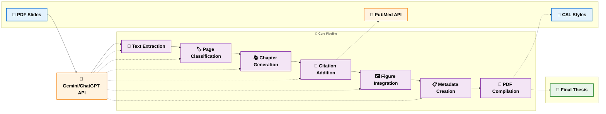

# Slide2Thesis

A tool that automatically generates a thesis document from a PDF presentation using AI APIs (Google Gemini or OpenAI ChatGPT).

## Features

- Extract text and images from PDF slides
- Categorize slides into logical sections
- Generate thesis chapters from slide content
- Add citations and references with **flexible citation styles**
- **CSL (Citation Style Language) support** with popular academic styles
- Generate figures and tables
- Compile a complete thesis document in PDF format
- **Automatic References section generation**
- Web interface for easy uploading and processing
- Command-line interface with extensive options

## System Architecture

The following flowchart illustrates the component flow and processing pipeline of Slide2Thesis:



### Processing Pipeline

The system follows a streamlined 7-step pipeline:

1. **📝 Text Extraction**: Extracts text content from each PDF page
2. **🏷️ Page Classification**: Uses AI to categorize pages into thesis sections
3. **📚 Chapter Generation**: Converts classified content into well-structured chapters
4. **📖 Citation Addition**: Automatically adds relevant academic citations via PubMed
5. **🖼️ Figure Integration**: Adds figure references and captions to chapters
6. **📋 Metadata Creation**: Generates YAML metadata for the thesis document
7. **🔨 PDF Compilation**: Compiles everything into a final PDF using Pandoc + Tectonic with **CSL citation styles**

The diagram uses modern styling with:
- **Blue**: Input (PDF slides, CSL styles)
- **Purple**: Core processing steps
- **Green**: Final output (thesis)
- **Orange**: External APIs (AI & PubMed)

The system supports both web interface and command-line interface with flexible AI provider support (Gemini/OpenAI).

## Installation

1. Clone this repository:
   ```
   git clone https://github.com/ythuang0522/Slide2Thesis.git
   cd Slide2Thesis
   ```

2. Install required libraries:
   ```
   pip install -r requirements.txt
   ```

3. Install additional dependencies:
   ```
   conda install -c conda-forge pandoc
   conda install tectonic
   
   # For macOS
   brew install pandoc-crossref
   
   # For Linux (Debian/Ubuntu)
   sudo apt-get install pandoc-crossref
   
   # For Linux (Fedora/RHEL/CentOS)
   sudo dnf install pandoc-crossref
   
   # Alternative for any system: Install via cabal (Haskell package manager)
   cabal update
   cabal install pandoc-crossref
   ```

## Usage

### Command Line Interface

#### Basic Usage:
```bash
# Run all steps with default settings
python main.py path/to/your/presentation.pdf

# Enable verbose logging
python main.py path/to/your/presentation.pdf -v
```

#### Complete Argument Reference:
```bash
python main.py PDF_FILE [OPTIONS]

Required:
  PDF_FILE                    Path to the input PDF presentation

Optional Arguments:
  -h, --help                  Show help message and exit
  -v, --verbose               Enable debug logging
  
AI Provider & Model:
  --provider {gemini,openai,auto}  AI API provider (default: auto-detect)
  -m MODEL, --model MODEL     Model name (auto-detects provider if not specified)
  --gemini-api-key KEY        Gemini API key (or set GEMINI_API_KEY in .env)
  --openai-api-key KEY        OpenAI API key (or set OPENAI_API_KEY in .env)
  
Processing Options:
  -e EMAIL, --email EMAIL     Email for PubMed API (or set PUBMED_EMAIL in .env)
  -t THREADS, --threads THREADS  Number of concurrent threads (default: 6)
  -s STYLE, --style STYLE     CSL citation style file (default: CSL/acm-sig-proceedings.csl)
  
Step Selection (if none specified, runs all steps):
  --extract-text              Extract text from PDF only
  --categorize-pages          Categorize pages only
  --generate-chapters         Generate chapters only
  --add-citations             Add citations to chapters only
  --add-figures               Add figure references only
  --generate-yaml             Generate YAML metadata only
  --compile                   Compile thesis PDF only
```

#### Citation Style Selection:
```bash
# Use default ACM style
python main.py presentation.pdf

# Use Nature style (biology/life sciences)
python main.py presentation.pdf -s CSL/nature.csl

# Use IEEE style (engineering/computer science)
python main.py presentation.pdf -s CSL/ieee.csl

# Use PLOS Biology style (open access biology)
python main.py presentation.pdf -s CSL/plos-biology.csl
```

#### Available Citation Styles:
- **ACM SIG Proceedings** (`CSL/acm-sig-proceedings.csl`) - Default, computer science
- **IEEE** (`CSL/ieee.csl`) - Engineering and computer science
- **Nature** (`CSL/nature.csl`) - Biology and life sciences
- **PLOS Biology** (`CSL/plos-biology.csl`) - Open access biology

#### AI Provider Selection:
```bash
# Auto-detect provider (default)
python main.py presentation.pdf --provider auto

# Use Google Gemini explicitly
python main.py presentation.pdf --provider gemini

# Use OpenAI ChatGPT with specific model
python main.py presentation.pdf --provider openai --model gpt-4

# Auto-detect provider from model name
python main.py presentation.pdf --model gemini-1.5-flash
python main.py presentation.pdf --model gpt-3.5-turbo
```

#### Step-by-Step Processing:
```bash
# Run individual steps
python main.py presentation.pdf --extract-text
python main.py presentation.pdf --categorize-pages
python main.py presentation.pdf --generate-chapters
python main.py presentation.pdf --add-citations
python main.py presentation.pdf --add-figures
python main.py presentation.pdf --generate-yaml
python main.py presentation.pdf --compile

# Combine multiple steps
python main.py presentation.pdf --generate-chapters --add-citations --compile
```

#### Advanced Examples:
```bash
# Full configuration with all options
python main.py presentation.pdf \
  --provider gemini \
  --model gemini-1.5-flash \
  --gemini-api-key YOUR_GEMINI_KEY \
  --email your.email@domain.com \
  --threads 8 \
  --style CSL/nature.csl \
  --verbose

# Process with OpenAI and custom threading
python main.py presentation.pdf \
  --provider openai \
  --model gpt-4 \
  --openai-api-key YOUR_OPENAI_KEY \
  --threads 4 \
  --style CSL/ieee.csl

# Run only citation and compilation steps
python main.py presentation.pdf \
  --add-citations \
  --compile \
  --style CSL/plos-biology.csl
```

### Web Interface

Start the web server:
```bash
python app.py
```

Then open your browser and navigate to http://127.0.0.1:5000 to access the web interface.

## Project Structure

- `main.py`: Main script orchestrating the thesis generation process
- `app.py`: Flask web application for the web interface
- `templates/`: HTML templates for the web interface
- **`CSL/`**: Citation Style Language files for different academic formats
  - `acm-sig-proceedings.csl`: ACM conference style (default)
  - `ieee.csl`: IEEE journal/conference style
  - `nature.csl`: Nature journal style
  - `plos-biology.csl`: PLOS Biology journal style
- `text_extractor.py`: Extracts text from PDF presentations
- `page_classifier.py`: Categorizes pages into logical sections
- `chapter_generator.py`: Generates thesis chapters
- `citation_generator.py`: Adds relevant citations
- `figure_generator.py`: Processes and references figures
- `yaml_metadata_generator.py`: Creates YAML metadata
- `thesis_compiler.py`: Compiles the final thesis document with CSL support
- `gemini_api.py`: Wrapper for Google's Gemini API
- `openai_api.py`: Wrapper for OpenAI's ChatGPT API
- `api_factory.py`: Factory for AI API selection

## Testing

Before running the tests, install the development dependencies:

```bash
pip install -r requirements-dev.txt
```

The project uses `pytest`. Run the test suite with:

```bash
pytest
```

## License

MIT

## Author

Yao-Ting Huang (@ythuang0522) 