# Slide2Thesis

A tool that automatically generates a thesis document from a PDF presentation using Google's Gemini API.

## Features

- Extract text and images from PDF slides
- Categorize slides into logical sections
- Generate thesis chapters from slide content
- Add citations and references
- Generate figures and tables
- Compile a complete thesis document in PDF format
- Web interface for easy uploading and processing

## System Architecture

The following flowchart illustrates the component flow and processing pipeline of Slide2Thesis:

```mermaid
flowchart LR
    A[📄 PDF Slides] --> B[🤖 Gemini/ChatGPT API]
    B --> C[📝 Text Extraction]
    C --> D[🏷️ Page Classification]
    D --> E[📚 Chapter Generation]
    E --> F[📖 Citation Addition]
    F --> G[🖼️ Figure Integration]
    G --> H[📋 Metadata Creation]
    H --> I[🔨 PDF Compilation]
    I --> J[📖 Final Thesis]

    subgraph inputs [" "]
        A
        K[📧 PubMed API]
    end

    subgraph processing ["🔄 Core Pipeline"]
        C
        D
        E
        F
        G
        H
        I
    end

    subgraph outputs [" "]
        J
    end

    F -.-> K
    B -.-> C
    B -.-> D
    B -.-> E
    B -.-> F
    B -.-> G
    B -.-> H

    classDef inputStyle fill:#e3f2fd,stroke:#1976d2,stroke-width:3px,color:#000
    classDef processStyle fill:#f3e5f5,stroke:#7b1fa2,stroke-width:2px,color:#000
    classDef outputStyle fill:#e8f5e9,stroke:#388e3c,stroke-width:3px,color:#000
    classDef apiStyle fill:#fff3e0,stroke:#f57c00,stroke-width:2px,color:#000

    class A inputStyle
    class C,D,E,F,G,H,I processStyle
    class J outputStyle
    class B,K apiStyle
```



### Processing Pipeline

The system follows a streamlined 7-step pipeline:

1. **📝 Text Extraction**: Extracts text content from each PDF page
2. **🏷️ Page Classification**: Uses AI to categorize pages into thesis sections
3. **📚 Chapter Generation**: Converts classified content into well-structured chapters
4. **📖 Citation Addition**: Automatically adds relevant academic citations via PubMed
5. **🖼️ Figure Integration**: Adds figure references and captions to chapters
6. **📋 Metadata Creation**: Generates YAML metadata for the thesis document
7. **🔨 PDF Compilation**: Compiles everything into a final PDF using Pandoc + Tectonic

The diagram uses modern styling with:
- **Blue**: Input (PDF slides)
- **Purple**: Core processing steps
- **Green**: Final output (thesis)
- **Orange**: External APIs (AI & PubMed)

The system supports both web interface and command-line interface with flexible AI provider support (Gemini/OpenAI).

## Installation

1. Clone this repository:
   ```
   git clone https://github.com/ythuang0522/Slide2Thesis.git
   cd Slide2Thesis
   ```

2. Install required libraries:
   ```
   pip install -r requirements.txt
   ```

3. Install additional dependencies:
   ```
   conda install -c conda-forge pandoc
   conda install tectonic
   
   # For macOS
   brew install pandoc-crossref
   
   # For Linux (Debian/Ubuntu)
   sudo apt-get install pandoc-crossref
   
   # For Linux (Fedora/RHEL/CentOS)
   sudo dnf install pandoc-crossref
   
   # Alternative for any system: Install via cabal (Haskell package manager)
   cabal update
   cabal install pandoc-crossref
   ```

## Usage

### Web Interface

Start the web server:
```bash
python app.py
```

Then open your browser and navigate to http://127.0.0.1:5000 to access the web interface.

### Command Line Interface

Basic usage:
```bash
python main.py path/to/your/presentation.pdf
```

For specific steps:
```bash
# Extract text only
python main.py path/to/your/presentation.pdf --extract-text

# Generate chapters only
python main.py path/to/your/presentation.pdf --generate-chapters

# Add citations only
python main.py path/to/your/presentation.pdf --add-citations

# Add figures only
python main.py path/to/your/presentation.pdf --add-figures

# Create YAML
python main.py path/to/your/presentation.pdf --generate-yaml

# Compile the final thesis
python main.py path/to/your/presentation.pdf --compile
```

## Project Structure

- `main.py`: Main script orchestrating the thesis generation process
- `app.py`: Flask web application for the web interface
- `templates/`: HTML templates for the web interface
- `text_extractor.py`: Extracts text from PDF presentations
- `page_classifier.py`: Categorizes pages into logical sections
- `chapter_generator.py`: Generates thesis chapters
- `citation_generator.py`: Adds relevant citations
- `figure_generator.py`: Processes and references figures
- `yaml_metadata_generator.py`: Creates YAML metadata
- `thesis_compiler.py`: Compiles the final thesis document
- `gemini_api.py`: Wrapper for Google's Gemini API

## Testing

Before running the tests, install the development dependencies:

```bash
pip install -r requirements-dev.txt
```

The project uses `pytest`. Run the test suite with:

```bash
pytest
```

## License

MIT

## Author

Yao-Ting Huang (@ythuang0522) 