# Slide2Thesis

A tool that automatically generates academic documents (thesis or journal papers) in LaTeX/PDF format from PDF presentations using AI APIs (Google Gemini or OpenAI ChatGPT).

## Features

- **Multi-Style Support**: Generate documents in different academic formats:
  - **Thesis format**: Traditional university thesis with chapters
  - **Nature journal format**: Scientific journal papers (Nature, Science, etc.)
- Extract text and images from PDF slides
- Generate structured content from slide material
- Add citations and references using traditional LaTeX bibliography
- Generate figures and tables with proper referencing
- Compile complete academic documents in PDF format
- Web interface for uploading and processing

## System Architecture

The following flowchart illustrates the component flow and processing pipeline of Slide2Thesis:

```mermaid
flowchart LR
    A[📄 PDF Slides] --> B[🤖 Gemini/ChatGPT API]
    B --> C[📝 Text Extraction]
    C --> D[🏷️ Page Classification]
    D --> E[📚 Chapter Generation]
    E --> F[📖 Citation Addition]
    F --> G[🖼️ Figure Integration]
    G --> H[📋 Metadata Creation]
    H --> I[🔨 PDF Compilation]
    I --> J[📖 Final Thesis]

    subgraph inputs [" "]
        A
        K[📧 PubMed API]
    end

    subgraph processing ["🔄 Core Pipeline"]
        C
        D
        E
        F
        G
        H
        I
    end

    subgraph outputs [" "]
        J
    end

    F -.-> K
    B -.-> C
    B -.-> D
    B -.-> E
    B -.-> F
    B -.-> G
    B -.-> H

    classDef inputStyle fill:#e3f2fd,stroke:#1976d2,stroke-width:3px,color:#000,font-size:24px,font-weight:bold
    classDef processStyle fill:#f3e5f5,stroke:#7b1fa2,stroke-width:2px,color:#000,font-size:24px,font-weight:bold
    classDef outputStyle fill:#e8f5e9,stroke:#388e3c,stroke-width:3px,color:#000,font-size:24px,font-weight:bold
    classDef apiStyle fill:#fff3e0,stroke:#f57c00,stroke-width:2px,color:#000,font-size:24px,font-weight:bold

    class A inputStyle
    class C,D,E,F,G,H,I processStyle
    class J outputStyle
    class B,K apiStyle
```



### Processing Pipeline

The system follows a streamlined 7-step pipeline:

1. **📝 Text Extraction**: Extracts text content from each PDF page
2. **🏷️ Page Classification**: Uses AI to categorize pages into thesis sections
3. **📚 Chapter Generation**: Converts classified content into well-structured chapters
4. **📖 Citation Addition**: Automatically adds relevant academic citations via PubMed
5. **🖼️ Figure Integration**: Adds figure references and captions to chapters
6. **📋 Metadata Creation**: Generates YAML metadata for the thesis document
7. **🔨 PDF Compilation**: Compiles everything into a final PDF using Pandoc + Tectonic with **traditional LaTeX bibliography**

The diagram uses modern styling with:
- **Blue**: Input (PDF slides)
- **Purple**: Core processing steps
- **Green**: Final output (thesis)
- **Orange**: External APIs (AI & PubMed)

The system supports both web interface and command-line interface with flexible AI provider support (Gemini/OpenAI).

## Installation

1. Clone this repository:
   ```
   git clone https://github.com/ythuang0522/Slide2Thesis.git
   cd Slide2Thesis
   ```

2. Install required libraries:
   ```
   pip install -r requirements.txt
   ```

3. Install compilers (pandoc, pandoc-crossref, and tectonic):
   ```
   conda install -c conda-forge pandoc
   conda install tectonic
   
   # For macOS
   brew install pandoc-crossref
   
   # For Linux (Debian/Ubuntu)
   sudo apt-get install pandoc-crossref   
   ```

## Usage

### Command Line Interface

#### Basic Usage:
```bash
# Generate thesis document (default: --style thesis)
python main.py path/to/your/presentation.pdf

# Generate Nature journal paper
python main.py path/to/your/presentation.pdf --style nature

# List available output styles
python main.py --list-styles

# Enable verbose logging
python main.py path/to/your/presentation.pdf -v
```

#### Complete Argument Reference:
```bash
python main.py PDF_FILE [OPTIONS]

Required:
  PDF_FILE                    Path to the input PDF presentation

Optional Arguments:
  -h, --help                  Show help message and exit
  -v, --verbose               Enable debug logging
  
AI Provider & Model:
  --provider {gemini,openai,auto}  AI API provider (default: auto-detect)
  -m MODEL, --model MODEL     Model name (auto-detects provider if not specified)
  --gemini-api-key KEY        Gemini API key (or set GEMINI_API_KEY in .env)
  --openai-api-key KEY        OpenAI API key (or set OPENAI_API_KEY in .env)

Output Style:
  --style {thesis,nature}     Output document style (default: thesis)
  --list-styles               List all available output styles
  
Processing Options:
  -e EMAIL, --email EMAIL     Email for PubMed API (or set PUBMED_EMAIL in .env)
  -t THREADS, --threads THREADS  Number of concurrent threads (default: 6)
  
Step Selection (if none specified, runs all steps):
  --extract-text              Extract text from PDF only
  --categorize-pages          Categorize pages only
  --generate-chapters         Generate chapters only
  --add-citations             Add citations to chapters only
  --add-figures               Add figure references only
  --generate-yaml             Generate YAML metadata only
  --compile                   Compile thesis PDF only
```

#### Output Styles:
The system supports multiple academic document formats:

**Thesis Style (default)**:
- Traditional university thesis format with chapters
- Uses custom Thesis.cls document class
- Supports Chinese/English abstracts and acknowledgments
- Bibliography style: plain (numbered references)

**Nature Journal Style**:
- Scientific journal paper format (Nature, Science, etc.)
- Uses Springer Nature sn-jnl.cls document class
- Single-column layout with journal-specific formatting
- Bibliography style: sn-nature (author-year citations)

You can list all available styles:
```bash
python main.py --list-styles
```

#### AI Provider Selection:
```bash
# Auto-detect provider (default)
python main.py presentation.pdf --provider auto

# Use Google Gemini explicitly
python main.py presentation.pdf --provider gemini

# Use OpenAI ChatGPT with specific model for Nature paper
python main.py presentation.pdf --provider openai --model gpt-4.1 --style nature

# Auto-detect provider from model name
python main.py presentation.pdf --model gemini-2.5-flash
```

#### Step-by-Step Processing:
```bash
# Run individual steps
python main.py presentation.pdf --extract-text
python main.py presentation.pdf --categorize-pages
python main.py presentation.pdf --generate-chapters
python main.py presentation.pdf --add-citations
python main.py presentation.pdf --add-figures
python main.py presentation.pdf --generate-yaml
python main.py presentation.pdf --compile

# Combine multiple steps with Nature style
python main.py presentation.pdf --generate-chapters --add-citations --compile --style nature
```

#### Advanced Examples:
```bash
# Full configuration with all options
python main.py presentation.pdf \
  --provider gemini \
  --model gemini-1.5-flash \
  --gemini-api-key YOUR_GEMINI_KEY \
  --email your.email@domain.com \
  --threads 8 \
  --verbose

# Process Nature paper with OpenAI and custom threading
python main.py presentation.pdf \
  --provider openai \
  --model gpt-4 \
  --openai-api-key YOUR_OPENAI_KEY \
  --style nature \
  --threads 4
```

### Web Interface

Start the web server:
```bash
python app.py
```

Then open your browser and navigate to http://127.0.0.1:5000 to access the web interface.

## Project Structure

### Entry Points (Root Level)
- `main.py`: Main CLI script orchestrating the document generation process
- `app.py`: Flask web application for the web interface

### Source Code Organization (`src/`)

#### AI API Modules (`src/ai/`)
- `ai_api_interface.py`: Abstract base class for AI API implementations
- `gemini_api.py`: Wrapper for Google's Gemini API
- `openai_api.py`: Wrapper for OpenAI's ChatGPT API
- `api_factory.py`: Factory for AI API selection and auto-detection

#### Processing Pipeline (`src/processors/`)
- `text_extractor.py`: Extracts text from PDF presentations
- `page_classifier.py`: Categorizes pages into logical sections
- `chapter_generator.py`: Generates structured content chapters
- `citation_generator.py`: Adds relevant citations via PubMed API
- `figure_generator.py`: Processes and references figures
- `yaml_metadata_generator.py`: Creates style-specific YAML metadata
- `thesis_compiler.py`: Compiles the final document using traditional LaTeX bibliography

#### Utilities (`src/utils/`)
- `style_manager.py`: Manages different output styles and templates
- `math_formatter.py`: Mathematical expression formatting utilities

### Templates & Assets
- `templates/`
  - `latex/thesis/`: Thesis document class and template files
  - `latex/nature/`: Nature journal class and template files
  - `*.html`: Web interface templates

## Adding New Document Styles

The system is designed to be easily extensible with new academic formats. To add a new journal or document style:

1. **Create template directory**: `templates/latex/your_style/`
2. **Add required files**:
   - `your_style-template.tex`: LaTeX template with pandoc variables
   - Document class files (`.cls`)
   - Bibliography style files (`.bst`)
   - Any additional assets

3. **Update style configuration** in `style_manager.py`:
   ```python
   'your_style': {
       'document_class': 'your_class',
       'template_file': 'templates/latex/your_style/your_style-template.tex',
       'template_dir': 'templates/latex/your_style',
       'bibliography_style': 'your_bib_style',
       'required_files': ['your_class.cls', 'your_bib_style.bst'],
       'metadata_type': 'journal'  # or 'thesis'
   }
   ```

4. **Add metadata generation** (if needed) in `yaml_metadata_generator.py`

The style system automatically handles file copying and pandoc configuration.

## License

MIT

## Author

Yao-Ting Huang (@ythuang0522) 